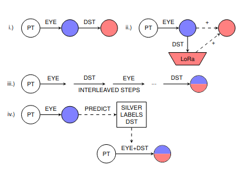

This repository contains the code and data for our paper

# 🧠 From Human Reading to NLM Understanding: Evaluating the Role of Eye-Tracking Data in Encoder-Based Models

## 📖 Overview
Cognitive signals, particularly eye-tracking data, offer valuable insights into human language processing. In this work, we explore how integrating knowledge of human reading behavior impacts Neural Language Models (NLMs) across multiple dimensions:
- **Downstream Task Performance**: Does injecting eye-tracking data degrade or enhance model performance?
- **Model Attention Alignment**: Does it make model attention weights more human-like?
- **Embedding Space Geometry**: Does it affect the structure of learned representations?

We experiment with multiple fine-tuning strategies for injecting eye-tracking features and analyze their effects.



## 📂 Repository Structure
```
├── modules/                # Code utilities
├── results/                # Output results, contains additional hetmaps
├── scripts/                # Scripts for training, evaluation, and analysis
```


## 📊 Results
Our key findings:
- Injecting eye-tracking data **preserves** downstream task performance.
- It **improves** correlation between model and human attention.
- It **compresses** the model’s embedding space, potentially aiding generalization.
